# Machine Learning Logistic Regression

Machine Learning Logistic Regression.

1. Logistic Regression
Implement logistic regression and apply it to two different datasets.
Build a logistic regression model to predict whether a student gets admitted into a university.
Determine each applicant's chance of admission based on their results on two exams. You have historical data from previous applicants that you can use as a training set for logistic regression. For each training
example, you have the applicant's scores on two exams and the admissions decision.
Build a classication model that estimates an applicant's probability of admission based the scores from those two exams.

2. Regularized logistic regression
Implement regularized logistic regression to predict whether microchips from a fabrication plant passes quality assurance (QA). During QA, each microchip goes through various tests to ensure it is functioning correctly. Testing results for some microchips on two different tests. From these two tests, to determine whether the microchips should be accepted or rejected. To help making the decision.

```python
import numpy as np
%matplotlib inline
import matplotlib.pyplot as plt
import scipy.optimize as opt
plt.style.use('seaborn-whitegrid')
```


```python
data = np.loadtxt("data/ex2data1.txt", delimiter=',')
```


```python
X = data[:,[0,1]]
y = data[:, 2]
# y = data[:, 2][np.newaxis].T
```

#### Visualizing the data


```python
plt.plot(X[(y==1).nonzero()[0],0], X[(y==1).nonzero()[0],1], 'k+')
plt.plot(X[(y==0).nonzero()[0],0], X[(y==0).nonzero()[0],1], 'ko',color="green")
plt.show()
```


    
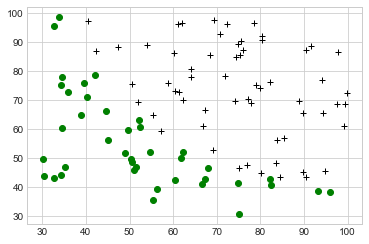
    


#### Sigmoid Function
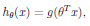
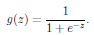


```python
def sigmoid(z):
    return 1/(1 + np.exp(-z))
```

#### Cost function and gradient
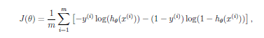

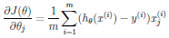


```python
def costFunction(theta, X, y, return_grad=False):
    m  = len(y)
#     theta = theta.reshape((n,1))
#     z = X @ theta
#     h = sigmoid(z)
#     J = (1/m) * np.sum(((-y)*np.log(h)) - ((1-y)*(np.log(1-h))))
#     grad = (1/m)* X.T @ (h-y)
    one = y * np.transpose(np.log( sigmoid( np.dot(X,theta) ) ))
    two = (1-y) * np.transpose(np.log( 1 - sigmoid( np.dot(X,theta) ) ))
    J = -(1./m)*(one+two).sum()
    
    grad = (1./m) * np.dot(sigmoid( np.dot(X,theta) ).T - y, X).T

    if return_grad == True:
        return J, np.transpose(grad)
    elif return_grad == False:
        return J # for use in fmin/fmin_bfgs optimization function
```


```python
(m,n) = X.shape
X = np.hstack((np.ones((m,1)),X))
# X_padded = np.column_stack((np.ones((m,1)), X)) 
```


```python
initial_theta = np.zeros(n+1)
(cost, grad) = costFunction(initial_theta, X, y, True)
print(cost, grad)
```

    0.6931471805599453 [ -0.1        -12.00921659 -11.26284221]
    


```python
test_theta = np.array([-24, 0.2, 0.2])
(cost, grad) = costFunction(test_theta, X, y, True)
print(cost, grad)
```

    0.21833019382659774 [0.04290299 2.56623412 2.64679737]
    

##### Set options for fminunc
options = optimset('GradObj', 'on', 'MaxIter', 400);

##### Run fminunc to obtain the optimal theta This function will return theta and the cost.
[theta, cost] = fminunc(@(t)(costFunction(t, X, y)), initial theta, options);


```python
initial_theta = np.zeros((n+1,1))
myargs=(X, y)
```


```python
theta = opt.fmin(costFunction, x0=initial_theta, args=myargs)
theta, cost_at_theta, _, _, _, _, _ = opt.fmin_bfgs(costFunction, 
                                                   x0=theta, args=myargs,
                                                    full_output=True)
```

    Optimization terminated successfully.
             Current function value: 0.203498
             Iterations: 157
             Function evaluations: 287
    Optimization terminated successfully.
             Current function value: 0.203498
             Iterations: 1
             Function evaluations: 12
             Gradient evaluations: 3
    


```python
(cost, grad) = costFunction(theta, X, y, True)
print(cost, grad)
```

    0.20349770158972494 [-2.35876134e-08 -4.09400750e-06 -7.86955589e-08]
    


```python
# Print theta to screen
print('Cost at theta found by fmin: {:f}'.format(cost_at_theta))
print('theta:'),
print(theta)
```

    Cost at theta found by fmin: 0.203498
    theta:
    [-25.16130062   0.20623139   0.20147139]
    

#### Evaluating and Plot the result


```python
def plotData(X, y):
#   PLOTDATA Plots the data points X and y into a new figure 
#   PLOTDATA(x,y) plots the data points with + for the positive examples
#   and o for the negative examples. X is assumed to be a Mx2 matrix.
    import matplotlib.pyplot as plt
    import numpy as np

    p1 = plt.plot(X[(y==1).nonzero()[0],0], X[(y==1).nonzero()[0],1],  '+', color='k')[0]
    p2 = plt.plot(X[(y==0).nonzero()[0],0], X[(y==0).nonzero()[0],1], 'o', color='y')[0]
    return plt, p1, p2
```


```python
def plotDecisionBoundary(theta, X, y):
#PLOTDECISIONBOUNDARY Plots the data points X and y into a new figure with
#the decision boundary defined by theta
#   PLOTDECISIONBOUNDARY(theta, X,y) plots the data points with + for the 
#   positive examples and o for the negative examples. X is assumed to be 
#   a either 
#   1) Mx3 matrix, where the first column is an all-ones column for the 
#      intercept.
#   2) MxN, N>3 matrix, where the first column is all-ones    
    import matplotlib.pyplot as plt
    import numpy as np
    # Plot Data
    fig = plt.figure()
    plt, p1, p2 = plotData(X[:, 1:3], y)
#     plt.hold(True)
    
    if X.shape[1] <= 3:
        aa = 0
#         Only need 2 points to define a line, so choose two endpoints
        plot_x = np.array([min(X[:,1])-2, max(X[:,1])+2])
        
        # Calculate the decision boundary line
        plot_y = (-1./theta[2])*(theta[1]*plot_x + theta[0])
        
        # Plot, and adjust axes for better viewing
        p3 = plt.plot(plot_x, plot_y)
        
        # Legend, specific for the exercise
        plt.legend((p1, p2, p3[0]),
                   ('Admitted','Not Admitted', 'Decision Boundary'),
                  numpoints=1, handlelength=0.5)
        plt.axis([30, 100, 30, 100])
        plt.show()
    else:
        # Here is the grid range
        u = np.linspace(-1, 1.5, 50)
        v = np.linspace(-1, 1.5, 50)
        z = np.zeros((len(u), len(v) ))
        
        # Evaluate z = theta*x over the grid
        for i in range(len(u)):
            for j in range(len(v)):
                z[i,j] = np.dot(mapFeature(np.array([u[i]]), 
                                           np.array([v[j]])), theta)
        z = np.transpose(z) # important to transpose z before calling contour
        
        # Plot z = 0
        # Notice you need to specify the level 0
        # we get collections[0] so that we can display a legend properly
        p3 = plt.contour(u, v, z, levels=[0], linewidth=2).collections[0]
        
        # Legend, specific for the exercise
        plt.legend((p1, p2, p3), ('y = 1', 'y = 0', 'Decision Boundary'), 
                   numpoints=1, handlelength=1)
        
        plt.show()
        
#     plt.hold(False) #prevents further drawing on plot
```


```python
plotDecisionBoundary(theta, X, y)
```


    
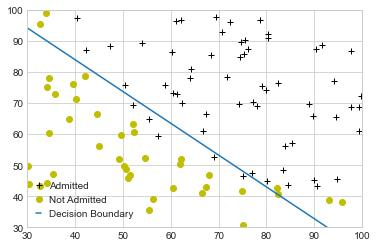
    


#### Predict and Accuracies


```python
def predict(theta, X):
    return sigmoid(X@theta) >= 0.5
```


```python
prob = sigmoid(np.dot(np.array([1,45,85]),theta))
print('For a student with scores 45 and 85, we predict an admission probability of {:f}'.format(prob))

# Compute accuracy on our training set
p = predict(theta, X)

print('Train Accuracy: {:f}'.format(np.mean(p == y) * 100))

```

    For a student with scores 45 and 85, we predict an admission probability of 0.776291
    Train Accuracy: 89.000000
    

## Regularized logistic regression


```python
import numpy as np
%matplotlib inline
import matplotlib.pyplot as plt
plt.style.use('seaborn-whitegrid')
```


```python
data = np.loadtxt("data/ex2data2.txt", delimiter=',')
```


```python
X = data[:, [0,1]]
y = data[:, 2]
# y = data[:, 2][np.newaxis].T
plotData(X,y)
plt.show()
```


    
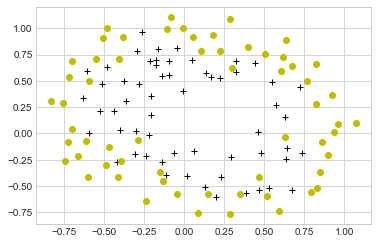
    


#### Feature mapping
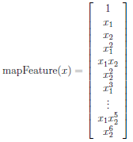


```python
def mapFeature(X1, X2):
# MAPFEATURE Feature mapping function to polynomial features
#
#   MAPFEATURE(X1, X2) maps the two input features
#   to quadratic features used in the regularization exercise.
#
#   Returns a new feature array with more features, comprising of 
#   X1, X2, X1.^2, X2.^2, X1*X2, X1*X2.^2, etc..
#   for a total of 1 + 2 + ... + (degree+1) = ((degree+1) * (degree+2)) / 2 columns
#
#   Inputs X1, X2 must be the same size
#
    degree = 6
    # could also use ((degree+1) * (degree+2)) / 2 instead of sum
    out = np.ones((X1.shape[0], sum(range(degree+2)) ))
    curr_column = 1
    for i in range(1,degree+1):
        for j in range(i+1):
            out[:, curr_column] = np.power(X1, i-j) * np.power(X2, j)
            curr_column += 1
    return out
```


```python
# Add Polynomial Features
X = mapFeature(X[:,0], X[:,1])
```


```python
# Initialize fitting parameters
initial_theta = np.zeros((X.shape[1],1))
y = data[:, 2]
```


```python
# Set regularization parameter lambda to 1
lambda_ = 1
```


```python
def sigmoid(z):
    return 1/(1+ np.exp(-z)) 
```

#### Cost function and gradient Regularized
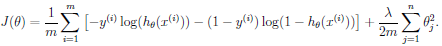

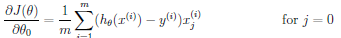

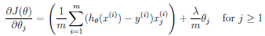


```python
def costFunctionReg(theta, X, y, lambda_, return_grad=False):
    m = len(y)
    grad = np.zeros(theta.shape)
#     h = sigmoid(X@theta)
#     J = (1/m) * np.sum(((-y)*np.log(h)) - ((1-y)*(np.log(1-h))))\
#     + (lambda_ / (2*m))*(theta[1:].T @ theta[1:])
#     grad[0] = ((1/m)* X.T @ (h-y))[0]
#     grad[1:] = (((1/m)* X.T @ (h-y)) + ((lambda_ / m)*theta))[1:]
    one = y * np.transpose(np.log( sigmoid( np.dot(X,theta) ) ))
    two = (1-y) * np.transpose(np.log( 1 - sigmoid( np.dot(X,theta) ) ))
    reg = ( float(lambda_reg) / (2*m)) * np.power(theta[1:theta.shape[0]],2).sum()
    J = -(1./m)*(one+two).sum() + reg

    # applies to j = 1,2,...,n - NOT to j = 0
    grad = (1./m) * np.dot(sigmoid( np.dot(X,theta) ).T - y, X).T + ( float(lambda_reg) / m )*theta

    # the case of j = 0 (recall that grad is a n+1 vector)
    # since we already have the whole vectorized version, we use that
    grad_no_regularization = (1./m) * np.dot(sigmoid( np.dot(X,theta) ).T - y, X).T

    # and then assign only the first element of grad_no_regularization to grad
    grad[0] = grad_no_regularization[0]
    if return_grad == True:
        return J, grad.flatten()
    elif return_grad == False:
        return J 
    
```


```python
(cost, grad) = costFunctionReg(initial_theta, X, y, lambda_, True)
print(cost, grad)
```

    0.6931471805599454 [8.47457627e-03 1.87880932e-02 7.77711864e-05 5.03446395e-02
     1.15013308e-02 3.76648474e-02 1.83559872e-02 7.32393391e-03
     8.19244468e-03 2.34764889e-02 3.93486234e-02 2.23923907e-03
     1.28600503e-02 3.09593720e-03 3.93028171e-02 1.99707467e-02
     4.32983232e-03 3.38643902e-03 5.83822078e-03 4.47629067e-03
     3.10079849e-02 3.10312442e-02 1.09740238e-03 6.31570797e-03
     4.08503006e-04 7.26504316e-03 1.37646175e-03 3.87936363e-02]
    


```python
test_theta = np.ones((X.shape[1],1))
(cost, grad) = costFunctionReg(test_theta, X, y, 10, True)
print(cost, grad)
```

    2.134848314665857 [0.34604507 0.08508073 0.11852457 0.1505916  0.01591449 0.16811439
     0.06712094 0.03217053 0.02604321 0.10719727 0.09725885 0.01098433
     0.04195657 0.00957212 0.12367776 0.05895534 0.01870409 0.01729323
     0.02352665 0.01513039 0.09858123 0.07328323 0.01051447 0.02270567
     0.00904832 0.02563548 0.00823079 0.10601204]
    


```python
import scipy.optimize as opt
# Initialize fitting parameters
initial_theta = np.zeros(X.shape[1])
# Set regularization parameter lambda to 1
lambda_reg = 1
# Set Options
myargs=(X, y, lambda_reg)
result = opt.fmin_bfgs(costFunctionReg, 
                     x0=initial_theta, args=myargs)
```

    Optimization terminated successfully.
             Current function value: 0.529003
             Iterations: 47
             Function evaluations: 1392
             Gradient evaluations: 48
    


```python
theta_result = result
(cost, grad) = costFunctionReg(theta_result, X, y, lambda_, True)
print(cost, grad)
```

    0.5290027422858311 [-7.42723211e-07  3.52682317e-06 -3.89862588e-07  8.22035800e-06
     -2.34419901e-06 -3.43893312e-06 -3.37494641e-06  3.97730375e-06
      2.09917595e-06  2.59913406e-06 -2.09256132e-06 -3.11131851e-06
     -3.79232881e-06  6.31643843e-07 -4.86402372e-07 -5.79473686e-06
      2.86160120e-06 -2.38501056e-06 -1.62636189e-07  1.20392225e-06
      2.20316886e-06 -5.24899058e-06 -1.51642881e-06 -1.79240054e-06
     -1.19266770e-06 -1.70105148e-06  9.96582060e-08  4.05004174e-07]
    


```python
def plotDecisionBoundary(theta, X, y):
#PLOTDECISIONBOUNDARY Plots the data points X and y into a new figure with
#the decision boundary defined by theta
#   PLOTDECISIONBOUNDARY(theta, X,y) plots the data points with + for the 
#   positive examples and o for the negative examples. X is assumed to be 
#   a either 
#   1) Mx3 matrix, where the first column is an all-ones column for the 
#      intercept.
#   2) MxN, N>3 matrix, where the first column is all-ones    
    import matplotlib.pyplot as plt
    import numpy as np
    # Plot Data
    fig = plt.figure()
    plt, p1, p2 = plotData(X[:, 1:3], y)
#     plt.hold(True)
    
    if X.shape[1] <= 3:
        aa = 0
#         Only need 2 points to define a line, so choose two endpoints
        plot_x = np.array([min(X[:,1])-2, max(X[:,1])+2])
        
        # Calculate the decision boundary line
        plot_y = (-1./theta[2])*(theta[1]*plot_x + theta[0])
        
        # Plot, and adjust axes for better viewing
        p3 = plt.plot(plot_x, plot_y)
        
        # Legend, specific for the exercise
        plt.legend((p1, p2, p3[0]),
                   ('Admitted','Not Admitted', 'Decision Boundary'),
                  numpoints=1, handlelength=0.5)
        plt.axis([30, 100, 30, 100])
        plt.show()
    else:
        # Here is the grid range
        u = np.linspace(-1, 1.5, 50)
        v = np.linspace(-1, 1.5, 50)
        z = np.zeros((len(u), len(v) ))
        
        # Evaluate z = theta*x over the grid
        for i in range(len(u)):
            for j in range(len(v)):
                z[i,j] = np.dot(mapFeature(np.array([u[i]]), 
                                           np.array([v[j]])), theta)
        z = np.transpose(z) # important to transpose z before calling contour
        
        # Plot z = 0
        # Notice you need to specify the level 0
        # we get collections[0] so that we can display a legend properly
#         p3 = plt.contour(u, v, z, levels=[0], linewidth=2).collections[0]
        p3 = plt.contour(u, v, z).collections[0]
        
        # Legend, specific for the exercise
        plt.legend((p1, p2, p3), ('y = 1', 'y = 0', 'Decision Boundary'), 
                   numpoints=1, handlelength=0)
        plt.xlabel('Microchip Test 1')
        plt.ylabel('Microchip Test 2')
        plt.title('lambda = {:f}'.format(lambda_reg))
        plt.show()
```


```python
# # Labels, title and Legend
plotDecisionBoundary(theta_result, X, y)
```


    
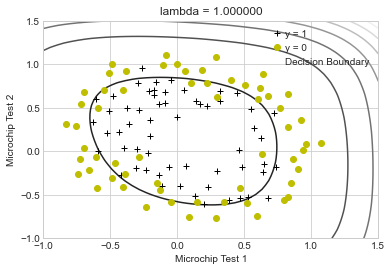
    


```python
def predict(theta, X):
    return sigmoid(X@theta) >= 0.5
```

#### Train Accuracy


```python
p = predict(theta_result, X)
accuracy = np.mean(p == y)*100
print(accuracy)
```

    83.05084745762711
    
